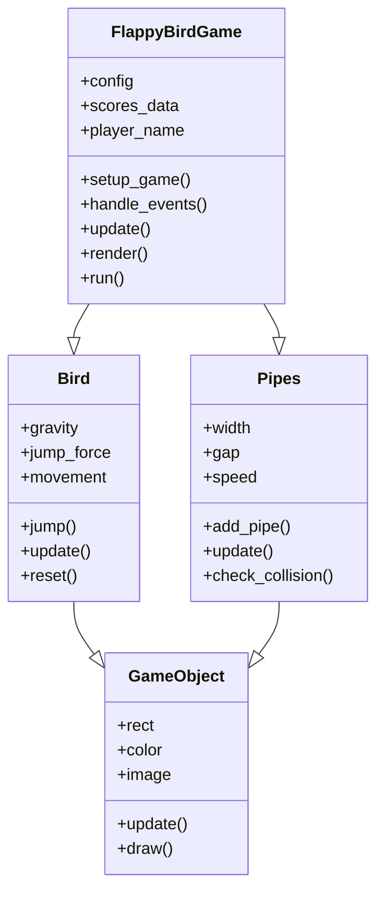

# Flappy Bird - Projekt Python

Klasyczna gra Flappy Bird zaimplementowana w Pythonie przy użyciu biblioteki Pygame.

## Autorzy
- Karol Ptak
- Michał Podsiadło

## Wymagania
- Python 3.6+
- Pygame 2.0+
- matplotlib (do generowania wykresów wyników)

## Instalacja
```bash
pip install pygame matplotlib
```

##Uruchamianie

Główny program:
```bash
python main.py
```

Testy jednostkowe:
```bash
python -m unittest tests.py
```

Testy wydajnościowe:
```bash
python performance_tests.py
```

##Opis projektu
Projekt implementuje grę Flappy Bird z następującymi funkcjonalnościami:
- Sterowanie ptakiem (spacja/kliknięcie)
- Generowanie losowych przeszkód (rury)
- System punktacji
- Zapisywanie wyników do pliku JSON
- Menu główne z opcjami
- Wyświetlanie najlepszych wyników
- Generowanie wykresów wyników

##Struktura projektu
FlappyBird/
├── main.py            # Główny plik uruchamiający grę
├── game.py            # Główna logika gry
├── bird.py            # Implementacja ptaka
├── pipes.py           # Implementacja rur
├── game_object.py     # Bazowa klasa obiektów gry
├── utils.py           # Narzędzia pomocnicze
├── config.json        # Konfiguracja gry
├── scores.json        # Zapisane wyniki
├── tests.py           # Testy jednostkowe
├── performance_tests.py # Testy wydajnościowe
└── README.md          # Dokumentacja

##Diagram klas


##Przykładowa konfiguracja

Plik config.json:
```bash
{
    "width": 400,
    "height": 650,
    "bg_color": [0, 0, 139],
    "gravity": 0.25,
    "jump_force": 7,
    "pipe_width": 60,
    "pipe_gap": 150,
    "pipe_speed": 3,
    "fps": 60
}
```

##Funkcje specjalne

- Możliwość zmiany nazwy gracza
- Generowanie wykresów z najlepszymi wynikami
- Filtrowanie wyników po nazwie gracza
- Automatyczne czyszczenie danych testowych
